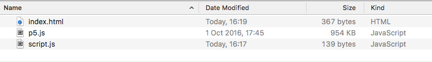

# Setting up

##### Environment
First download [atom](https://atom.io) this is a text editer but unlike textEdit on the mac this adds colors to your code making it easier to read. There is no other effective difference between the two you are welcome to write your code in textEdit but it will be harder to read.

We will be using a library called [p5](http://p5js.org). This is a bunch of tools that will mean we can write a lot less code by calling the functions given to us by p5. You need to download [p5](https://github.com/processing/p5.js/releases/download/0.5.4/p5.js).


##### Files
Create a folder somewhere you can remember on you computer and give it a name, I recommend your desktop. Open atom, under the "file" menu, in the top left corner of the screen, click on "open", then navigate to the folder you created. Select the folder then click open in the bottom left corner of the window.

Navigate back to the "file" menu and select "new file", a new empty window should open where you should be able to type. When you type it will just look like plain text and in order to change this we need to tell atom what type of file we are typing in. Navigate back to the "file" menu and click "save", make sure you are saving the file inside of your project folder and give it the name ```index.html```. Repeat the previus process for a new file but this time save it as ```script.js```. We also need to copy the p5.js file that we downloaded into our project folder.



##### Adding code
The index.html is the file that your browser (safari, chrome) reads and this is where we link in are javascript code files "script.js" and "p5.js". The html file has a bunch of what we call boilerplate essentailly code that has to be in every file. Don't worry about remembering this you can just copy it from here.
```html
<!DOCTYPE html>
<html>
  <head>
    <title>Boilerplate</title>
    <script rel="text/javascript" src="p5.js"></script>
    <script rel="text/javascript" src="script.js"></script>
  </head>
</html>

```
